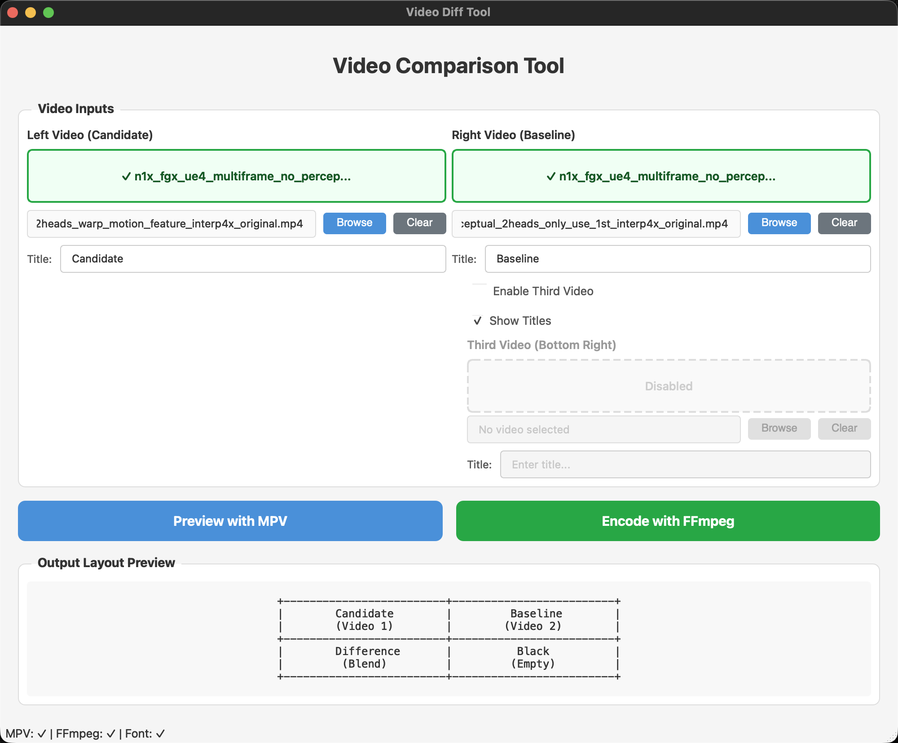
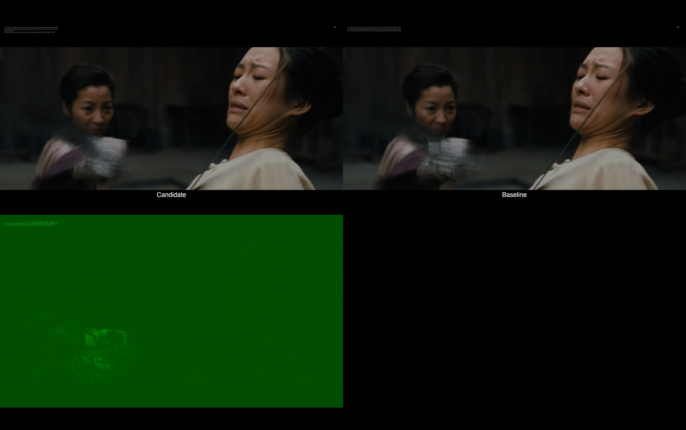

# Video Diff Tool

A cross-platform GUI tool for comparing videos side-by-side with difference visualization. Supports real-time preview with MPV and encoding with FFmpeg.



## Features

- **Video Comparison**: Compare two videos side-by-side with automatic difference visualization
- **Real-time Preview**: Preview comparisons using MPV player
  
  

- **FFmpeg Encoding**: Encode comparison videos with H.264 4:4:4 output, or HEVC 4:4:4 via NVENC when available
- **Optional Third Video**: Add a third video to the bottom-right quadrant
- **Debug View Mode**: Crop 4K debug videos down to `Display Image`, `Flow`, `Mask`, or `Warped` panels before preview and encoding
- **In-App Updates**: Packaged macOS and Windows builds can detect newer GitHub releases, update in place, and restart automatically
- **Drag & Drop**: Easy video file selection with drag and drop support
- **Customizable Titles**: Add custom overlay titles to each video
- **Cross-platform**: Works on macOS and Windows
- **Persistent Settings**: All preferences are saved automatically

## Output Layout

```
+------------+------------+
|  Video 1   |  Video 2   |
| (Candidate)| (Baseline) |
+------------+------------+
|    Diff    |  Video 3   |
|   Blend    | (Optional) |
+------------+------------+
```

## Requirements

### System Requirements
- Python 3.10 or higher
- MPV player (for preview)
- FFmpeg (for encoding)

### Python Dependencies
```bash
pip install -r requirements.txt
```

### Developer Test Dependencies
```bash
pip install -r requirements-dev.txt
```

## Installation

### 1. Install Python dependencies
```bash
cd video_diff_tool
pip install -r requirements.txt
```

### 2. Install MPV

**macOS:**
```bash
brew install mpv
```

**Windows:**
- Download from https://mpv.io/installation/
- Or use Chocolatey: `choco install mpv`
- Or use Scoop: `scoop install mpv`

### 3. Install FFmpeg

**macOS:**
```bash
brew install ffmpeg
```

**Windows:**
- Download from https://ffmpeg.org/download.html
- Or use Chocolatey: `choco install ffmpeg`
- Or use Scoop: `scoop install ffmpeg`

## Usage

### Launch the application
```bash
python main.py
```

## Releasing

Push a semantic version tag such as `v1.3.0` to trigger the GitHub release workflow.
Pre-release tags such as `v1.4.0-rc1` are also supported and will be published as GitHub pre-releases.

- **macOS**: Builds on `macos-14` and publishes a `macos-arm64` zip
- **Windows**: Builds on `windows-latest` and publishes a `windows-x64` zip
- **Release Guard**: The workflow checks that the tag version matches the About dialog version string before publishing

You can also rerun the release flow manually with **Actions → Release → Run workflow** and provide an existing tag.

## Testing

Run the full local test suite with:

```bash
pytest -q
```

GitHub Actions runs:

- Cross-platform unit and GUI tests on Ubuntu, Windows, and macOS
- Smoke tests using real `ffmpeg` and `mpv` binaries
- Packaging smoke builds on macOS and Windows using PyInstaller
- Release builds only after the full release test matrix passes

### Basic Workflow

1. **Add Videos**: Drag and drop video files into the Left and Right video zones, or click "Browse..."
2. **Set Titles**: Enter custom titles for each video (optional)
3. **Preview**: Click "Preview with MPV" to see the comparison in real-time
4. **Encode**: Click "Encode with FFmpeg" to create an encoded comparison video

### Debug View Mode

1. Set **Comparison Mode** to **Debug View**
2. Choose one debug panel: **Display Image**, **Flow**, **Mask**, or **Warped**
3. Preview or encode to compare that cropped panel side-by-side with a difference view

Debug View mode expects both inputs to be `3840x2160` debug renders with the standard 2x2 panel layout.

### Enable Third Video

1. Check "Enable Third Video (Bottom Right)"
2. Add a video to the third video zone
3. The third video will appear in the bottom-right quadrant

### Encoding Options

- **Resolution**: 2160p (default), 1080p, 720p, or custom
- **FPS**: 60 fps (default), configurable
- **Encoder**: Auto-selects NVENC HEVC 4:4:4 when available, otherwise falls back to CPU H.264 4:4:4
- **Quality**: QP 17 (default), configurable
- **GOP**: 30 (default), configurable

### Settings

Access settings via **File → Settings** to configure:
- MPV/FFmpeg binary paths
- Font file for overlays
- Default video titles
- Default encoding parameters

## Encoding Details

### Default Encoding Settings
- **Codec**: H.264 High 4:4:4 Predictive by default, or HEVC 4:4:4 via NVENC when available
- **Pixel Format**: YUV444P only
- **Resolution**: 3840×2160 (2160p)
- **Frame Rate**: 60 fps
- **Quality**: QP 17
- **GOP Size**: 30

### Hardware Encoders Supported
- **NVIDIA**: NVENC (hevc_nvenc), when 4:4:4 encoding support is available

### Video Scaling
- Input videos are scaled to fit 1/2 of output resolution
- Aspect ratio is preserved with letterboxing/pillarboxing

## Troubleshooting

### "MPV not found"
- Ensure MPV is installed and in your PATH
- Or manually set the path in Settings

### "FFmpeg not found"
- Ensure FFmpeg is installed and in your PATH
- Or manually set the path in Settings

### "Font not found"
- The tool auto-detects system fonts
- If detection fails, manually select a .ttf or .otf font in Settings

### "Frame count mismatch"
- All input videos must have the same number of frames
- Use videos from the same source/render for best results

## License

MIT License
